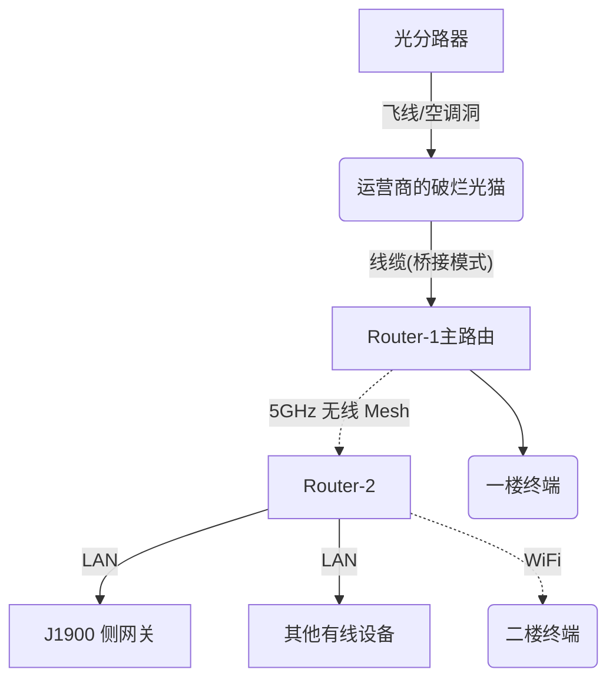

## 前言

部分内容来自于互联网、朋友、群友。

> [!Tip] 在编写博客的文章时, 将默认读者有流畅访问 Github / Google 等网站的能力。

本文使用设备:
- CPU: Intel(R) Celeron(R) CPU J1900
- RAM: 4GB
- STORAGE: 32GB
- NIC: Realtek RTL8111E * 1

做了什么:
- 安装ImmWrt
- 配置科学上网 & 设备分流
- 局域网DNS

其实本来是想补全一个网口来做主路由的, 不过鸽了好久再捡起来发现补网口的难度太大了, 遂放弃。

## 正文


### 0x00: 关于我家不得不说的奇妙网络结构

目前住的是一套 2000 年左右建的二手两层复式。在当年的小县城, 还没有“弱电箱”的概念, 导致这套房子的走线极其 HACK。这套房子的光纤入户方式令人惊叹：光纤从分光箱拉到车库, 再从车库“飞”到客厅, 最后顺着空调管道钻进室内。

从一楼到二楼（我的房间）的跨层布线则更加抽象。光猫位于一楼客厅, 原房主留下的网线路径极尽迂回：从客厅空调孔出墙, 绕进隔壁卧室面板, 再从窗户打洞拉到二楼卧室。即便这条“高龄”网线能用, 它也覆盖不到我的房间。——但我还有台服务器呢

作为家里最没有话语权的“能工智人”, 我只能发挥一下主观能动性了：300块钱买了两台小米 AX3000T, 一楼二楼各一个, 利用小米自带的无线 Mesh 组网。这样我就能用上网线了。

但话又说回来了, 延迟居然还很稳定, 在2楼ping一楼网关稳定在1ms, 几乎不丢包：
```plaintext
--- 192.168.2.1 ping 统计 ---
已发送 1282 个包,  已接收 1269 个包, 1.01404% packet loss, time 1291989ms
rtt min/avg/max/mdev = 0.668/6.176/2050.560/90.560 ms, pipe 3
```

所以, 网络结构大概如下




### 0x01: 安装系统中的那些事

虽然我是最近才开始把这台机子作为旁路由使用, 但在此之前我是有安装过Fedora Desktop来使用的(完全不可用...很卡), 然后因为这个, 安装系统的过程中就出岔子了。

我要安装的是 [immortalwrt](https://github.com/immortalwrt/immortalwrt), 因为immwrt没法直接通过ventoy引导来安装, 所以只能用其他系统写进小主机的存储内。 但当我打开WindowsPE准备操作时, 神奇的事情发生了——WindowsPE根本不显示有这么一块存储设备, 更别说DiskGenius这类软件了。经过一番调查, 发现先前装过的系统就是问题的根源, 于是去网上下了 TinyCore, 用 dd 命令抹掉硬盘, 然后再把 ImmortalWRT 镜像写进去, 系统就装好了。

本次安装我选用了squashfs作为分区格式, 没有为什么, 只是因为我对OP的经验不多, 所以我认为应该什么都用一下体验一下才能知道好与坏。


Generated by Google Gemini

这种情况通常源于 Windows 的 **PnP（即插即用）枚举机制与挂载管理器（MountMgr）的保护性策略**。

当 Windows 扫描物理总线发现磁盘后, 内核驱动（`disk.sys`）会尝试读取分区表。若该硬盘在 Linux 下被格式化为 Windows 无法识别的复杂分区结构（如 LVM 逻辑卷、特定的 GPT 分区标志或损坏的超级块）, Windows 的文件系统驱动可能会在解析元数据时因**读取超时**或**IO 控制异常**而挂起。

为了维持系统的稳定性并防止资源管理器（Explorer.exe）因尝试挂载非法分区而卡死, Windows 内核可能会选择**放弃枚举该物理设备**。这导致该设备在高级视图（如“此电脑”或“磁盘管理”）中完全消失, 但在更底层的磁盘工具（如 `diskpart` 或设备管理器）中往往仍能看到处于“异常”状态的硬件实例。



### 0x02: 基本设置进行时

现在系统装完了, 轮到设置了, 我的目的是配置 根据设备分流的配置科学上网 & 局域网DNS, 那么我选择使用daed + podman 运行clash的组合技。

不过在此之前, 得先让op连上网, 不是吗。由于 ImmortalWRT 默认ip地址是`192.168.1.1`, 所以我们得先去 tty 把 IP 改掉。

#### 修改默认 IP 地址
1. 把键盘和屏幕接到主机上 ( 好吧刚装完系统也不用拔 )
2. 登录, 默认用户是`root`, 没有密码
3. 输入以下命令
```bash
# 1. 设置 LAN 口的静态 IP
uci set network.lan.ipaddr='192.168.2.X'
# 2. 设置网关
uci set network.lan.gateway='192.168.2.1'
# 3. (可选) 设置 DNS
uci set network.lan.dns='223.5.5.5'
# 4. 提交所有修改到配置文件
uci commit network
# 5. 重启网络服务令设置生效
/etc/init.d/network restart
```
4. 打开浏览器, 访问自己设置的IP地址并登录

#### 基础设置
1. 在开始下面的设置前, 先给`root`用户改密码
2. 设一个自己喜欢的主机名, 比如我选择了最近上映的《超时空辉夜姬》中的辉夜作为主机名:`KaguyaHIME`。不过设备多还是别用二次元命名法了, 管起来头疼。
3. 扩容 `overlays` 分区
   1. 安装磁盘管理工具 ( 两种安装方式 ): 
      1. 在网页管理界面安装`fdisk lsblk block-mount kmod-fs-ext4`
      2. 命令安装, 命令如下:
        ```bash
        opkg install fdisk lsblk block-mount kmod-fs-ext4
        ```
   2. 格式化分区:
      1. 执行命令`fdisk /dev/sdX`, 其中`sdX`请替换为目标硬盘分区, 后续不再赘述
      2. 在 TUI 界面中, 输入 `p` 查看当前硬盘的所有分区。
      3. 输入 `n`, 一路回车, 最后输入 `w` 保存并退出。
      4. 执行命令 `mkfs.ext4 /dev/sdX`
   3. 挂载新的分区为overlay分区：
      1. 首先备份现有的配置:
        ```bash
        mount /dev/sda3 /mnt
        cp -a /overlay/. /mnt
        umount /mnt
        ```
      2. 修改挂载点:
        打开网页控制台的 `系统` -> `挂载点`, 找到`/dev/sdX` 然后将其挂载点设置为 “作为外部 overlay 使用”
   4. 保存并应用, 然后重启主机
   
#### 插件设置
1. Argon 主题 
   1. 直接在软件包里搜索 `luci-theme-argon`, 点击安装
   2. `侧边栏` > `系统` > `系统` > `语言和界面` > `主题`, 选择`argon`
   3. `侧边栏` > `系统` > `Argon 主题设置` > `壁纸来源` 改为内建, 然后上传一张喜欢的图片
2. luci-app-ttyd
   1. 这是一个在网页访问tty控制台的插件, 搜索`ttyd`即可完成安装
   2. 设置免密访问:
      1. 找到 `系统` > `终端` > `配置` > `命令` 改为 `/bin/login -f root`, 保存并应用
      2. 刷新, 查看效果

### 0x03: 出发! 迈向高级配置~

在上面把基本改善体验的配置改好了~那么是时候搞正经东西了!

1. **先安装 daed 插件**: [luci-app-daed](https://github.com/QiuSimons/luci-app-daed)
负责流量的劫持与路由，将符合条件的流量转发到clash内核中处理
2. **安装 Podman**:
   1. **前置条件**：请确保机器上有 `> 500MB` 的存储空间。
   2. **安装核心组件**：
   ImmortalWrt 24.10 的内核（6.6.110）非常新，OverlayFS 已经内置在内核里了（可以用 `cat /proc/filesystems` 确认），所以不需要装 `kmod-overlay`。 直接装本体：
   ```bash
   opkg update
   opkg install podman fuse-overlayfs conmon

   ```

   2. **修改镜像存储路径**：
   默认的镜像存储路径在 `/var` ，重启镜像就全丢了。所以我们要修改配置，让他换个地方存储
   新建一个目录，我习惯使用`/app`目录，修改podman配置文件 `/etc/containers/storage.conf`：
   ```bash
   mkdir -p /app/podman/storage

   ```


   将配置改为以下内容，确保 `graphroot` 指向我们的持久化分区：
   ```ini
   [storage]
   driver = "overlay"
   graphroot = "/app/podman/storage"
   runroot = "/tmp/run/containers"

   [storage.options.overlay]
   mountopt = "nodev,metacopy=off"

   ```


   3. **安装 podman-compose**：
   无法通过`opkg`一键安装 
   ```bash
   # 下载脚本
   curl -o /usr/bin/podman-compose https://rev.mihari.top/raw.githubusercontent.com/containers/podman-compose/main/podman_compose.py
   chmod +x /usr/bin/podman-compose

   # 安装Python & 依赖
   # 由于用的是python-light，没有pip，所以要在opkg装python依赖
   opkg update && opkg install python3-light libpython3-3.11 python3-asyncio python3-base python3-click python3-codecs python3-dotenv python3-email python3-light python3-logging python3-urllib python3-uuid python3-yaml

   ```

3. **部署 Mihomo-Alpha 核心**:
   > [!Important]
   > 开启 eBPF 模式前，必须确保宿主机挂载了 BPF 文件系统，否则容器会启动失败：
   > `mkdir -p /sys/fs/bpf && mount -t bpf bpf /sys/fs/bpf`


   为了减少心智负担，使用podman compose来运行clash核心

   在 `/app/clash` 目录下准备好你订阅，命名为`config.yaml`，然后写入这份配置：
```yaml
services:
clash:
   restart: always
   container_name: clash
   image: ccr.ccs.tencentyun.com/crispy_p0tato/mihomo:Alpha
   # image: metacubex/clash-meta:Alpha
   network_mode: host
   privileged: true
   pid: host
   cap_add:
      - CAP_PERFMON
      - CAP_BPF
      - CAP_NET_ADMIN
      - CAP_SYS_ADMIN
      - CAP_NET_BIND_SERVICE
   command:
      - -d
      - /etc/clash
      - -f
      - /etc/clash/config.yml
   volumes:
      - ./clash:/etc/clash
      - /sys/fs/bpf:/sys/fs/bpf
```

   最后，执行 `podman compose up -d`，等待`clash`核心启动成功
1. 回头来配置